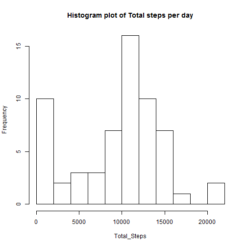
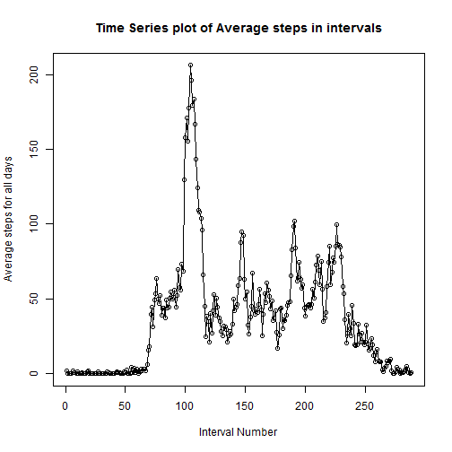
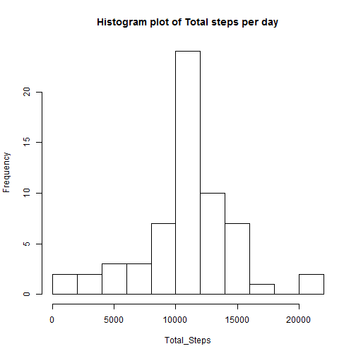
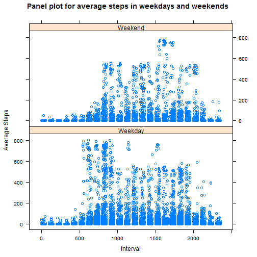

## Loading and preprocessing the data

```r
setwd("C:/Users/105046673/Documents/Coursera/Reproducible Research/Week 2/repdata_data_activity")
a<-read.csv("activity.csv") # The activity file is read into a variable a
summary(a)
```

```
##      steps                date          interval     
##  Min.   :  0.00   2012-10-01:  288   Min.   :   0.0  
##  1st Qu.:  0.00   2012-10-02:  288   1st Qu.: 588.8  
##  Median :  0.00   2012-10-03:  288   Median :1177.5  
##  Mean   : 37.38   2012-10-04:  288   Mean   :1177.5  
##  3rd Qu.: 12.00   2012-10-05:  288   3rd Qu.:1766.2  
##  Max.   :806.00   2012-10-06:  288   Max.   :2355.0  
##  NA's   :2304     (Other)   :15840
```


## What is mean total number of steps taken per day?

```r
fn <- function(activity=1){
b <- split(a,a$date)
dates <- c(levels(as.factor(a$date)))
dailysteps <- data.frame(matrix(NA, nrow = 61, ncol = 2), stringsAsFactors = FALSE) # Initiating a dummy matrix

#################################################
########### Creating Dailysteps Data ############
#################################################

for(i in 1:61){          
     d <- data.frame(b[i])
     colnames(d)<-c("steps","Date","Interval")
     dailysteps[i, ] <- c(dates[i],sum(d$steps,na.rm=T))
}

#################################################
##############   Histogram Plot   ###############
#################################################

dailysteps[,2] <- as.numeric(dailysteps[,2])
colnames(dailysteps) <- c("Date","Total_Steps")
hist(as.numeric(dailysteps$Total_Steps),xlab="Total_Steps",ylab="Frequency",main="Histogram plot of Total steps per day",breaks=10)

#################################################
#########   Calculating Mean and Median   #######
#################################################

MeanDailySteps <- mean(dailysteps[,2])
print(MeanDailySteps)
MedianDailySteps <- median(dailysteps[,2])
print(MedianDailySteps)
}
fn(activity = 1)
```

 

```
## [1] 9354.23
## [1] 10395
```


## What is the average daily activity pattern?


```r
#################################################
#######   Averaging steps from all days   #######
#################################################
e <- split(a,a$interval)
Avgstpint <- data.frame(matrix(NA, nrow = length(e), ncol = 2), stringsAsFactors = FALSE)
for(j in 1:length(e)){
     f <- data.frame(e[j])
     colnames(f) <- c("steps","date","interval")
     Avgstpint[j,] <- c(j,mean(f$steps,na.rm=TRUE))
}

#################################################
#########   Creating Time Series Plot   #########
#################################################

Avgstpint1 <- as.ts(Avgstpint)
plot.ts(Avgstpint[,1],Avgstpint[,2],xlab = "Interval Number",ylab = "Average steps for all days", main = "Time Series plot of Average steps in intervals",xy.lines=T)
```

 

```r
#############################################################
#########   Finding Interval with Max Average Steps #########
#############################################################

Maxinterval <- which.max(Avgstpint[,2])
print(Maxinterval)
```

```
## [1] 104
```


## Imputing missing values

```r
g <- sum(is.na(a$steps))
     for (k in 1:nrow(a)){
          m <- floor((k/288))
################################################################
#########   Imputing with Average Data of the interval #########
################################################################
          if(is.na(a$steps[k])){
               if((k-(m*288))!=0){
          a$steps[k] <- Avgstpint[[(k-(m*288)),2]]
               }
               else{
                    a$steps[k]<-Avgstpint[[288,2]]
               }
          }
     }
fn(activity=1)
```

 

```
## [1] 10766.19
## [1] 10766.19
```

## Are there differences in activity patterns between weekdays and weekends?

```r
a[,4] <- weekdays(as.Date(a$date))
     a[,4] <- weekdays(as.Date(a$date))
     for (l in 1:nrow(a))
          {
          if(a[l,4]== "Saturday")
          {
               a[l,5] <- "Weekend"
          }
          
          else if(a[l,4]== "Sunday")
          {
          a[l,5] <- "Weekend"
          }
          else
          {
                    a[l,5] <-"Weekday"
                    }
     }
     colnames(a) <- c("steps","date","interval","day","type of day")
     a[,5] <- as.factor(a$`type of day`)
###############################################################
#########   Using Lattice plot for panel plot of data #########
###############################################################  
     library(lattice)
xyplot(a$steps ~ a$interval | a$`type of day`,layout=c(1,2),xy.lines=FALSE,xlab = "Interval",ylab = "Average Steps", main = "Panel plot for average steps in weekdays and weekends")
```

 

